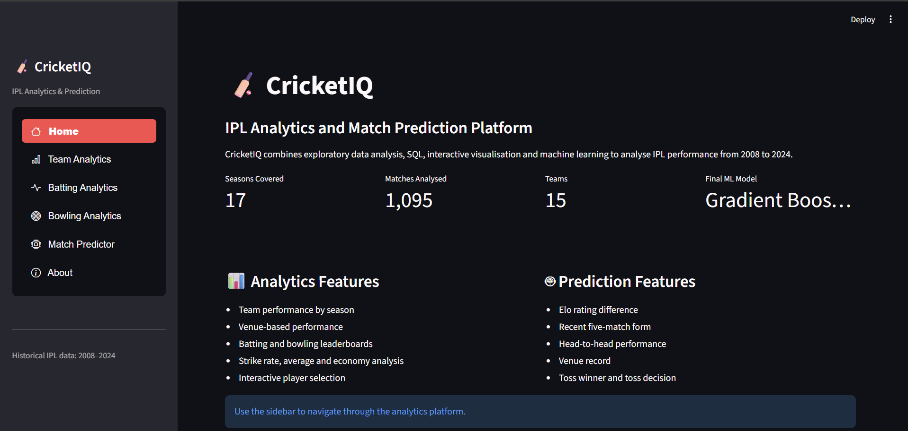
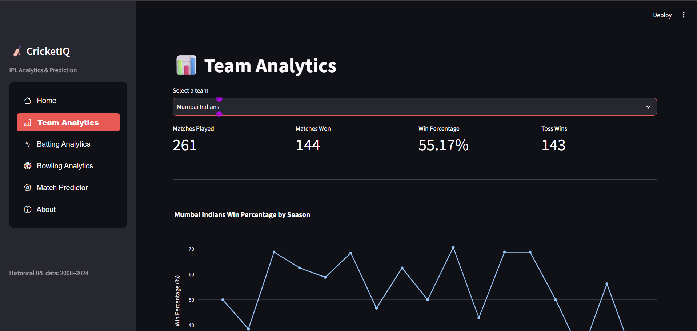
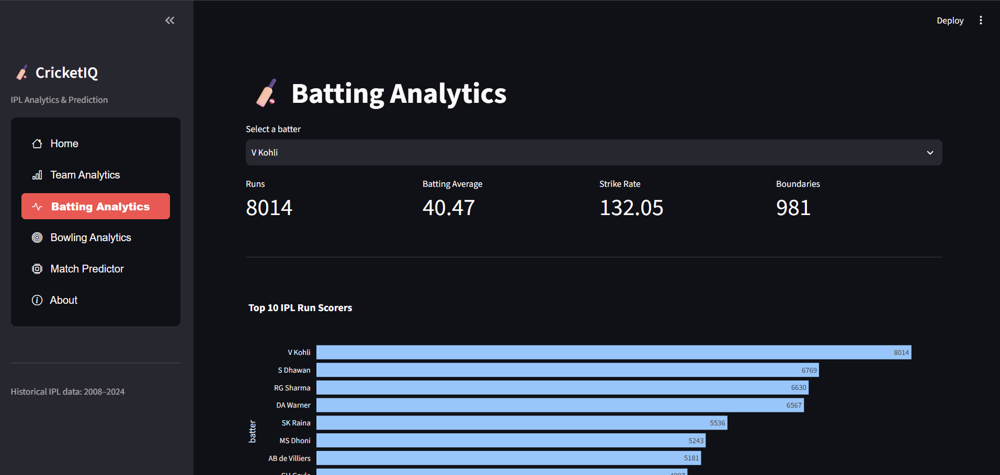
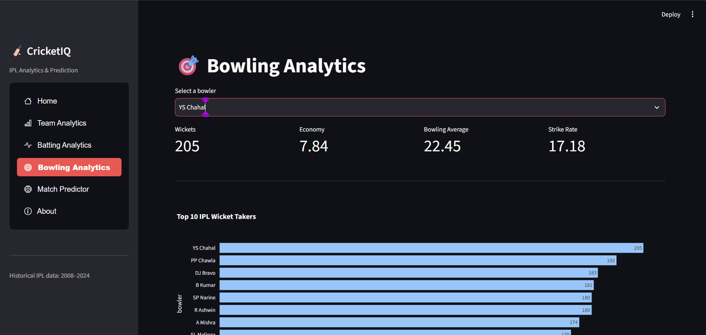
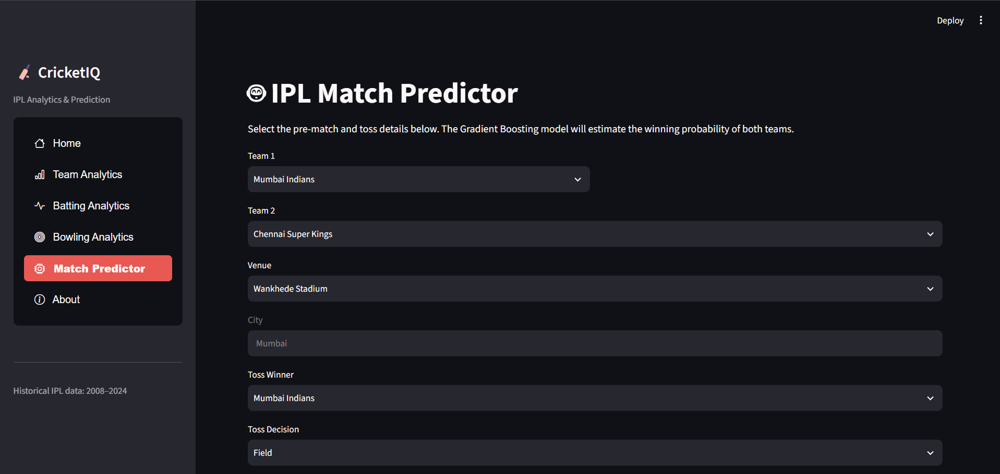
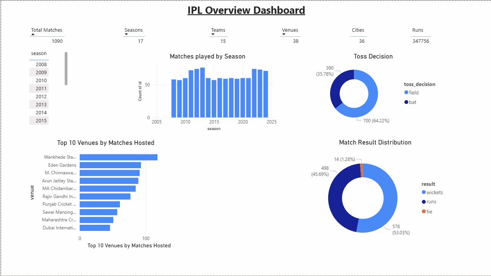
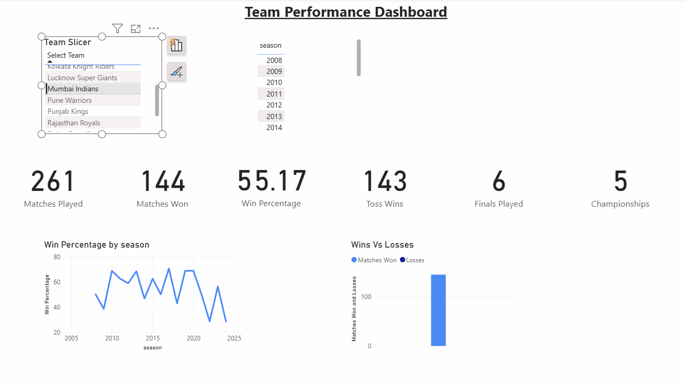
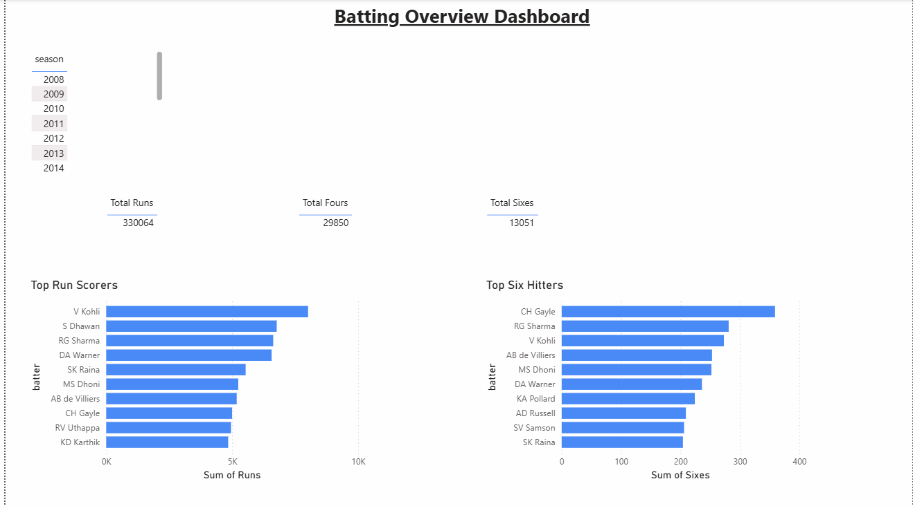
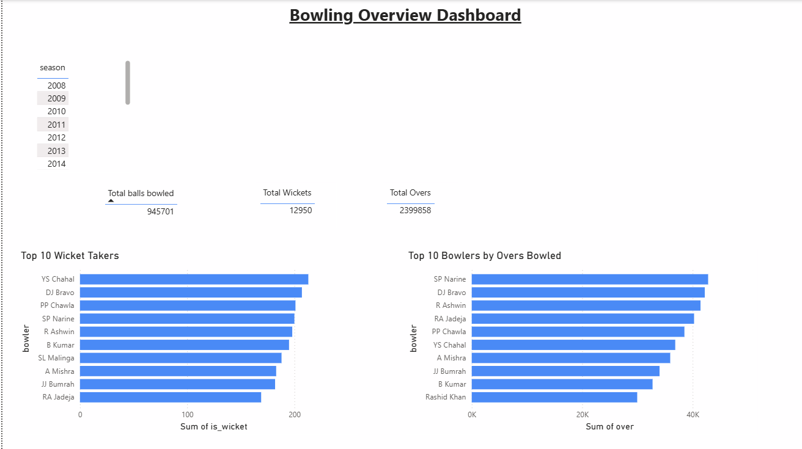

# CricketIQ
### End-to-End IPL Analytics & Match Prediction Platform

**Built with Python • SQL • Machine Learning • Streamlit • Power BI**


</div>

---

# 📌 Project Overview

CricketIQ is an end-to-end IPL analytics platform developed using historical Indian Premier League data from **2008–2024**.

The project combines **Data Cleaning, Exploratory Data Analysis (EDA), SQL Analytics, Feature Engineering, Machine Learning, Power BI Dashboards, and a Streamlit Web Application** to generate meaningful cricket insights and predict IPL match outcomes.

Rather than focusing only on model building, CricketIQ demonstrates the complete Data Science workflow—from raw datasets to a fully deployed analytics application.

---

# 🎯 Objectives

- Analyze 17 IPL seasons (2008–2024)
- Discover meaningful batting, bowling and team insights
- Build an accurate machine learning model for IPL match prediction
- Develop an interactive Streamlit application
- Design professional Power BI dashboards
- Showcase an end-to-end Data Science portfolio project

---

# 🚀 Features

## 📊 Team Analytics

- Team-wise performance summary
- Season-wise win percentage
- Best venues for every team
- Toss statistics
- Overall team records

---

## 🏏 Batting Analytics

- Top run scorers
- Most sixes
- Strike Rate Analysis
- Batting leaderboards

---

## 🎯 Bowling Analytics

- Top wicket takers
- Economy Rate Analysis
- Overs Bowled
- Bowling leaderboards

---

## 🤖 Match Predictor

Predicts the winner of an IPL match using a trained **Gradient Boosting Classifier** based on:

- Team Strength (Elo Rating)
- Recent Team Form
- Head-to-Head Record
- Venue Performance
- Toss Winner
- Toss Decision

---

## 📈 Power BI Dashboards

The project also includes four interactive Power BI dashboards:

- IPL Overview Dashboard
- Team Performance Dashboard
- Batting Dashboard
- Bowling Dashboard

---

# 🛠 Tech Stack

| Category | Technologies |
|-----------|--------------|
| Programming | Python |
| Data Analysis | Pandas, NumPy |
| Visualization | Plotly |
| Machine Learning | Scikit-Learn |
| Model Storage | Joblib |
| SQL | DuckDB |
| Dashboard | Power BI |
| Web Application | Streamlit |
| Version Control | Git & GitHub |

---

# 📂 Project Architecture

```text
Raw IPL Dataset
        │
        ▼
Data Cleaning & Preprocessing
        │
        ▼
Exploratory Data Analysis (EDA)
        │
        ▼
SQL Analytics
        │
        ▼
Feature Engineering
        │
        ▼
Machine Learning
(Gradient Boosting Classifier)
        │
        ▼
Model Serialization (.pkl)
        │
        ▼
Streamlit Web Application
        │
        ▼
Interactive IPL Analytics Platform
```

---

# 🧠 Machine Learning Pipeline

The prediction model utilizes several cricket-specific engineered features including:

- Elo Rating System
- Recent Team Form
- Head-to-Head Statistics
- Venue Win Percentage
- Toss Winner
- Toss Decision
- Team Strength

## Model Performance

| Model | Accuracy | Balanced Accuracy | Precision | Recall | F1 Score | ROC-AUC |
|---|---:|---:|---:|---:|---:|---:|
| Dummy Classifier | 0.507042 | 0.500000 | 0.000000 | 0.000000 | 0.000000 | 0.500000 |
| Gradient Boosting | 0.464789 | 0.464683 | 0.457143 | 0.457143 | 0.457143 | 0.490079 |
| Random Forest | 0.492958 | 0.492063 | 0.483871 | 0.428571 | 0.454545 | 0.480159 |
| Logistic Regression | 0.521127 | 0.520635 | 0.515152 | 0.485714 | 0.500000 | 0.466667 |

- Dummy Classifier
- Logistic Regression
- Random Forest Classifier
- ✅ Gradient Boosting Classifier (Final Model)

The **Gradient Boosting Classifier** achieved the best overall performance and was selected as the final production model.

### Model Limitations

- Predictions are based on historical IPL patterns.
- Player availability and playing XI are not currently included.
- Injuries, pitch condition, weather and in-match events are not considered.
- The output represents model-estimated probability, not certainty.

# 📊 Exploratory Data Analysis

The project includes detailed cricket analysis such as:

- Season-wise Trends
- Orange Cap Winners
- Purple Cap Winners
- Powerplay Analysis
- Death Overs Analysis
- Venue Analysis
- Toss Impact
- Team Performance
- Batting Records
- Bowling Records
- Win Percentage Analysis

---

## Dataset

The project uses IPL match-level and ball-by-ball datasets containing:

- match metadata
- teams and winners
- venues and cities
- toss information
- batting deliveries
- bowling deliveries
- dismissal information

# 🗃 SQL Analytics

SQL was used to perform advanced cricket analytics including:

- Team Rankings
- Player Rankings
- Venue Statistics
- Aggregate Analysis
- Window Functions
- Common Table Expressions (CTEs)

---

# 💻 Streamlit Application

The web application consists of:

- 🏠 Home
- 📊 Team Analytics
- 🏏 Batting Analytics
- 🎯 Bowling Analytics
- 🤖 Match Predictor
- ℹ️ About

---

# 📸 Application Screenshots

## 🏠 Home



---

## 📊 Team Analytics



---

## 🏏 Batting Analytics



---

## 🎯 Bowling Analytics



---

## 🤖 Match Predictor



---

# 📈 Power BI Dashboards

## IPL Overview Dashboard



---

## Team Performance Dashboard



---

## Batting Dashboard



---

## Bowling Dashboard



---

# 📁 Project Structure

```text
CricketIQ
│
├── dashboard/
│   └── CricketIQ Dashboard.pbix
│
├── data/
│   ├── raw/
│   └── processed/
│
├── docs/
│
├── images/
│
├── models/
│   ├── ipl_gradient_boosting_model.pkl
│   ├── ipl_historical_state.pkl
│   └── ipl_model_metadata.pkl
│
├── notebooks/
│
├── sql/
│
├── streamlit/
│   └── app.py
│
├── README.md
├── requirements.txt
└── .gitignore
```

---

# ⚙️ Installation

Clone the repository

```bash
git clone https://github.com/YOUR_GITHUB_USERNAME/CricketIQ.git
```

Navigate to the project directory

```bash
cd CricketIQ
```

Install the dependencies

```bash
pip install -r requirements.txt
```

Run the application

```bash
cd streamlit
streamlit run app.py
```

---

# 🔮 Future Enhancements

- Live IPL API Integration
- Real-Time Match Win Probability
- Fantasy Team Recommendation System
- Player Similarity Engine
- Live Score Dashboard
- Player Career Analytics
- Team Comparison Dashboard

---

# 👨‍💻 Author

**Anuj Mehrotra**

B.Tech – Mathematics & Computing  
Manipal Institute of Technology (MAHE)

GitHub: https://github.com/anujmehrotra

---

<div align="center">

### ⭐ If you found this project interesting, consider giving it a Star!

</div>
